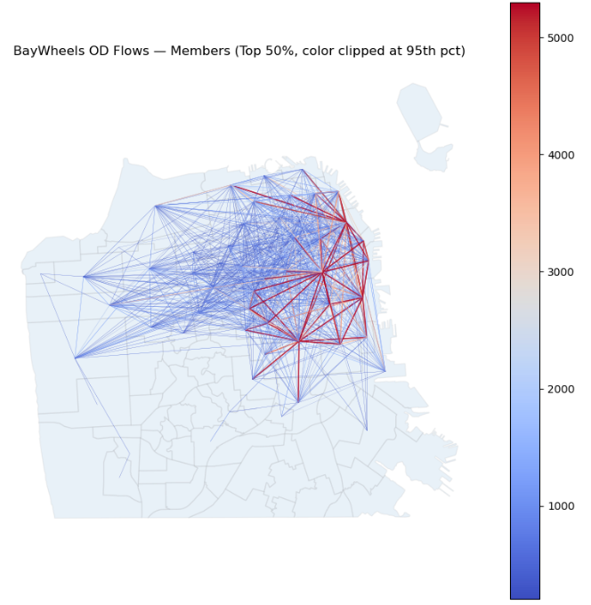
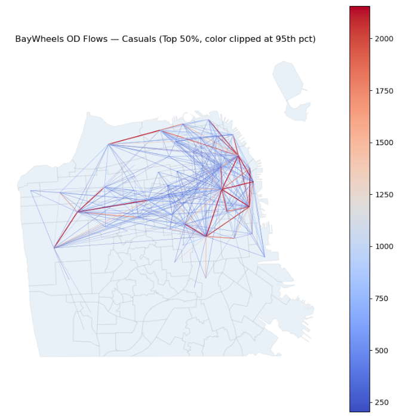
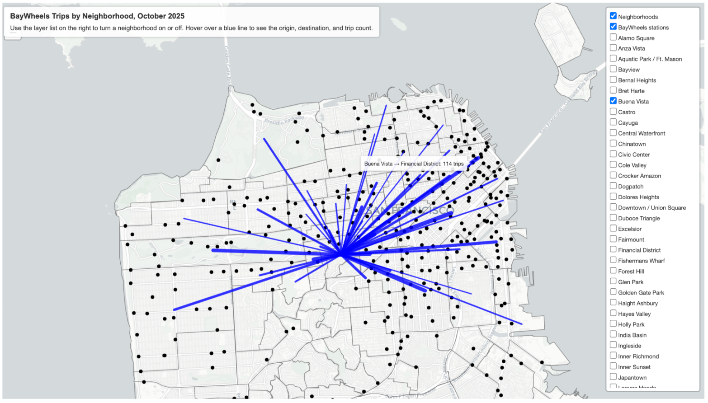
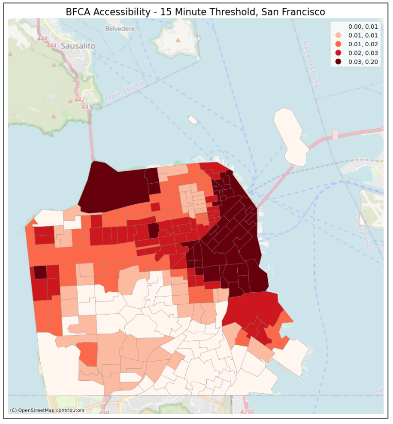
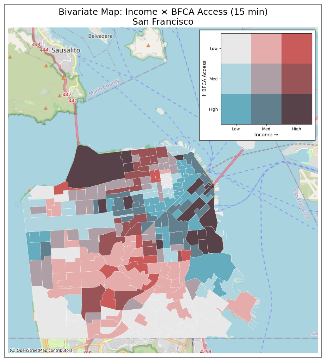
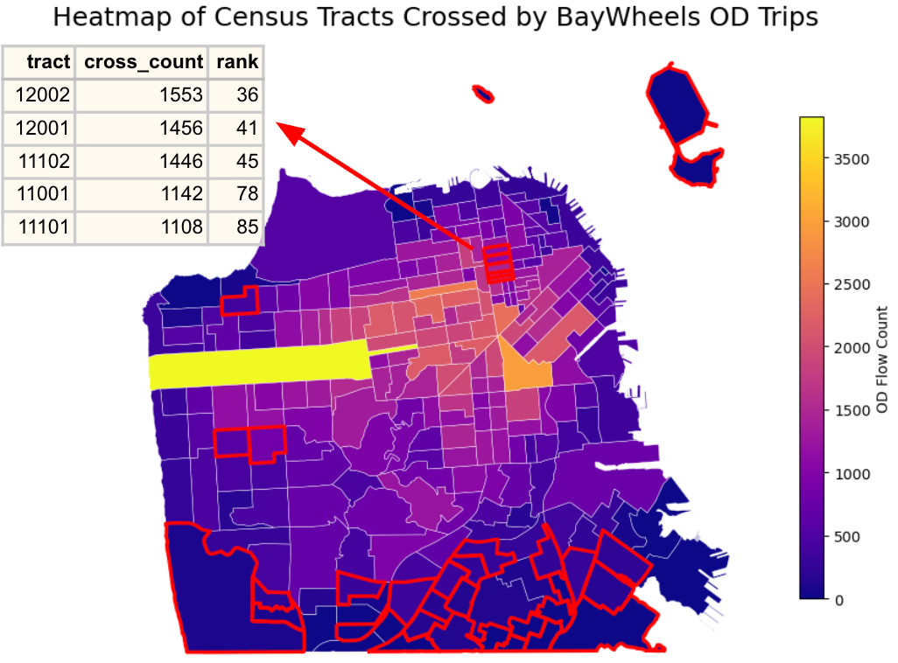
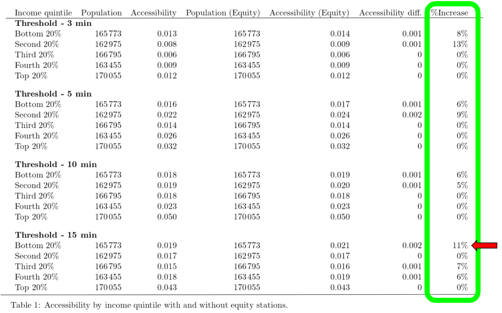

# Assessing Accessibility and Equity of Bay Wheels Bike Share Stations in San Francisco

## Table of Contents

<ol>
  <li><a href="#overview">Overview</a></li>
  <li><a href="#research-questions">Research Questions</a></li>
  <li><a href="#data-sources">Data Sources</a></li>
  <li><a href="#results">Results</a></li>
  <li><a href="#references">References</a></li>
  <li><a href="#data">Data</a></li>
  <li><a href="#tools--technologies">Tools & Technologies</a></li> 
</ol>

## Overview

This project evaluates the spatial accessibility and equity of the **Bay Wheels bike share system in San Francisco**.

While bike share provides an affordable and sustainable mobility option, accessibility depends heavily on station locations, walking distance, dock capacity, and integration with surrounding land uses. This study aims to:

- Measure current bike share accessibility across San Francisco
- Identify accessibility disparities across socioeconomic groups
- Develop a data-driven framework for prioritizing future bike station locations

**Key Finding:**  
A GIS-based station siting model identified **10 potential equity-focused bike stations**, improving accessibility by up to **11%** for underserved communities.

## Research Questions

1. How accessible are Bay Wheels stations across different neighborhoods?
2. Do low-income communities experience different levels of bike share accessibility?
3. Where should future stations be located to maximize equity improvements?

## Data Sources

The analysis integrates transportation, demographic, spatial, and points-of-interest (POI) datasets:

| Dataset | Description | Purpose |
|----------|-------------|---------|
| Bay Wheels Station Data | Station locations and dock capacity | Bike share accessibility analysis |
| Bay Wheels Ridership Data | Origin-destination trip patterns | Travel demand and usage analysis |
| U.S. Census ACS 2023 | Socioeconomic characteristics | Equity analysis and demographic evaluation |
| OpenStreetMap | Street network and walking accessibility | Network-based accessibility modeling |
| Registered Business Locations (DataSF) | Business locations across San Francisco | Spatial reference points for accessibility modeling |
| SF Mid Block Points (DataSF) | Street block midpoint locations | Spatial reference points for accessibility modeling |
| Muni Stops - San Francisco (DataSF) | Public transit stop locations | Spatial reference points for accessibility modeling |

The final dataset includes:

- 376 Bay Wheels stations in San Francisco
- Station-level ridership records
- Census tract demographic information
- Street network information
- Points-of-interest (POI) locations including businesses, transit stops and mid-blocks

## Methodology

### 1. Bike Share Network and Demand Flow Analysis

A station-level network was constructed to analyze Bay Wheels user travel patterns and visualize origin-destination (OD) flows across San Francisco.

The network was defined as:

- **Nodes:** 376 Bay Wheels stations in San Francisco
- **Links:** Station pairs connected by at least one recorded trip
- **Edge Weight:** Total number of trips between each station pair

Separate networks were developed for **member** and **casual** users to compare differences in travel behavior and demand patterns.

  
  

A dynamic Origin-Destination (OD) flow map was developed at the San Francisco neighborhood level to provide initial insights into:

- Dominant neighborhood-to-neighborhood travel patterns
- Spatial differences between member and casual users
- High-demand corridors and station connections

  

### 2. BFCA Framework

The accessibility scoring system is designed to evaluate each census tract in San Fancisco.

**Balanced Floating Catchment Area (BFCA) Model**

The BFCA model evaluates accessibility by considering both population demand and bike station supply within a given travel time threshold.

Where:

- $P_i$ = population at Census tract $i$
- $S_j$ = supply (number of docks) at station $j$
- $w_{ij}$ = 1 when travel time is smaller than the relevant threshold, otherwise = 0

Step 1: Distribute each tract's population across reachable stations

$$
P_j = \sum_{i=1}^{n} P_i w_{ij}
$$

Step 2: Distribute each station's supply back to all reachable tracts

$$
w_{ij}^{j} = \frac{w_{ij}}{\sum_i w_{ij}}
$$

Step 3: Calculate accessibility for each tract

$$
A_i = \sum_{j=1}^{J}
\frac{S_j w_{ij}^{j}}
{\sum_{i=1}^{n} P_i w_{ij}^{j}}
$$

The accessibility measure satisfies:

$$
\sum_i A_i P_i = \sum_j S_j
$$

### 3. Accessibility and Equity Assessment

After applying the BFCA framework, multiple walking time thresholds (5, 10, 15, and 20 minutes) were tested to evaluate bike share accessibility across San Francisco Census tracts.

The 15-minute walking threshold was selected as the primary accessibility measure, as it represents a realistic walking distance for accessing bike share stations.

  

A bivariate analysis was conducted by combining Census tract income levels with BFCA accessibility scores to identify areas experiencing potential accessibility inequities.

  

To incorporate actual travel demand patterns, a trip-based heatmap was developed by counting the number of Bay Wheels OD trip paths crossing each Census tract. The tracts outlined in red are previously identified low-income, low-access communities, many of which still experience high through-traffic, suggesting underserved but high-demand areas.

  

By combining:
- Low-income communities
- Low bike share accessibility
- High Bay Wheels trip activity

10 Census tracts were identified as priority candidates for future equity-focused station siting.

### 4. Equity-Based Station Siting Model

A GIS-based suitability model was developed to identify priority locations for future Bay Wheels stations by integrating equity factors, population demand, and accessibility to key destinations.

The framework includes:

Step 1: Demand Weight Calculation
Estimated block group demand by incorporating population and equity factors (using block group median income):

$$
Demand\ Weight_i = Population_i \times Equity\ Factor_i
$$

Step 2: Candidate Site Generation
Extracted potential station locations from POIs, including: SF Mid Block Points, Muni stops and Registered Business Locations

Step 3: Calculate Proximity Scores
Each candidate location was evaluated based on proximity to essential destinations (Public transit stations) and community attractions (business locations).

The proximity score was calculated based on distance decay:

$$
S_{e/a} = \frac{0.19-d+0.001}{0.19}
$$

where:

- $d$ = distance between the candidate site and the nearest destination

Step 4: Suitability Scoring
Evaluated candidate sites based on proximity to essential destinations and attractions, including transit access and community resources.

$$
SS =
\left(\frac{S_e-S_{e,min}}{S_{e,max}-S_{e,min}}\right)\times0.5+
\left(\frac{S_a-S_{a,min}}{S_{a,max}-S_{a,min}}\right)\times0.5
$$

Step 5: Site Ranking
Applied a market share model combining demand weights, suitability scores, and distance decay to rank candidate locations and select priority equity stations.

$$
M_j =
\sum_i b_i
\frac{SS_j/d_{ij}}
{\sum_j(SS_j/d_{ij})}
$$

where:

- $M_j$ = estimated market share of candidate station $j$
- $b_i$ = demand weight of Census block group $i$
- $d_{ij}$ = distance between demand location $i$ and candidate station $j$

The top-ranked candidate location was selected as priority equity station site in each census tract.

## Results

The proposed equity stations improve accessibility for underserved communities, with low-income areas experiencing up to **11% accessibility improvement** under the 15-minute walking threshold.

  

## References

Banerjee, S., Kabir, M. M., Khadem, N. K., & Chavis, C. (2020). Optimal locations for bikeshare stations: A new GIS based spatial approach. Transportation Research Interdisciplinary Perspectives, 4, 100101. https://doi.org/10.1016/j.trip.2020.100101

## Data

Due to file size limitations, some raw datasets used in this project are not included in this repository. The datasets can be accessed from the original sources below:

| Dataset | Description |
|----------|-------------|
| [SF Census Tracts](https://data.sfgov.org/Geographic-Locations-and-Boundaries/Census-2020-Tracts-for-San-Francisco/tmph-tgz9/about_data) | Census tract boundaries for spatial analysis |
| [SF Census Block Groups](https://data.sfgov.org/Geographic-Locations-and-Boundaries/Census-2020-Block-Groups-for-San-Francisco/24e8-pd2q/about_data) | Census block group boundaries for demographic and equity analysis |
| [Bay Wheels Station Data](https://baywheels.com/system-data) | Station locations and dock capacity |
| [Bay Wheels Trip Data](https://baywheels.com/system-data) | Historical bike share trip records |
| [Census Demographic Data](https://data.census.gov/) | Population, income, and socioeconomic characteristics |
| [Street Network Data](https://www.openstreetmap.org/) | Pedestrian network for accessibility analysis |
| [SF Mid Block Points](https://data.sfgov.org/Geographic-Locations-and-Boundaries/San-Francisco-Mid-Block-Points/iqyu-pwpr/about_data) | Candidate station locations and spatial reference points |
| [Muni Stops](https://data.sfgov.org/Transportation/Muni-Stops/i28k-bkz6/about_data) | Public transit accessibility indicators |
| [Registered Business Locations](https://data.sfgov.org/Economy-and-Community/Registered-Business-Locations-San-Francisco/g8m3-pdis/about_data) | Points of interest for station siting and community activity analysis |

Processed datasets used for analysis can be provided upon request.

## Tools & Technologies

### Programming

- Python
  - Data processing
  - Network analysis
  - Statistical modeling

### GIS

- ArcGIS
- QGIS

### Analysis Methods

- Network accessibility analysis
- Balanced Floating Catchment Area (BFCA)
- Origin-Destination analysis
- GIS suitability modeling
- Equity-based transportation planning
